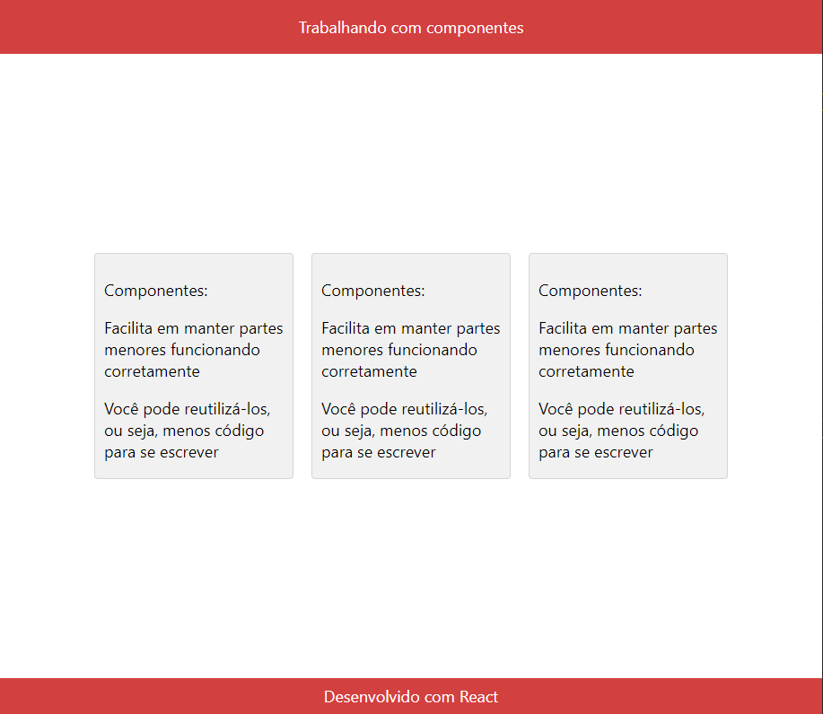

<h1>Primeira Aplicação React</h1>

 Esta aplicação tem como objetivo dar inicio a aplicações com a framework React.

<h3>Alguns conceitos aprendidos com o projeto</h3>,

<ul>
    <li>O que é um componente e sua utilidade</li>
    <li>Exportar um componente</li>
    <li>Importar um componente</li>
    <li>Como uma aplicação React funciona</li>
</ul>

